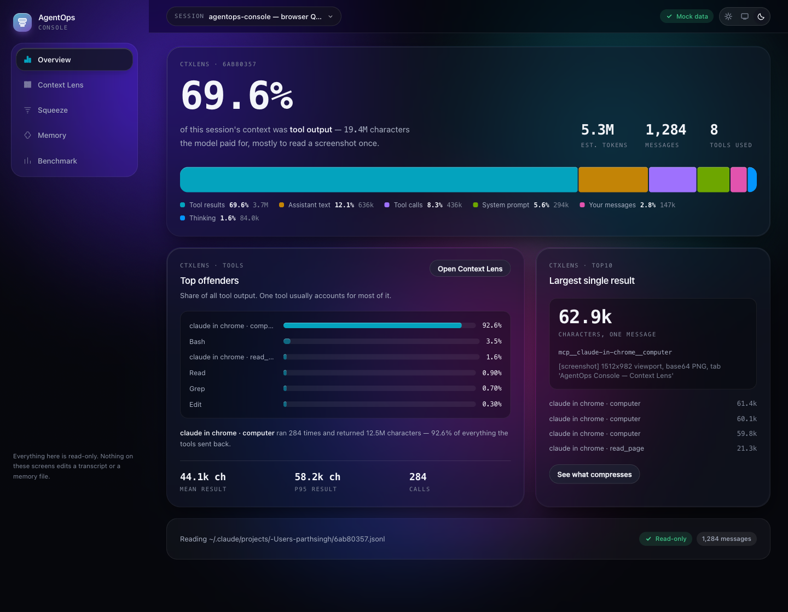
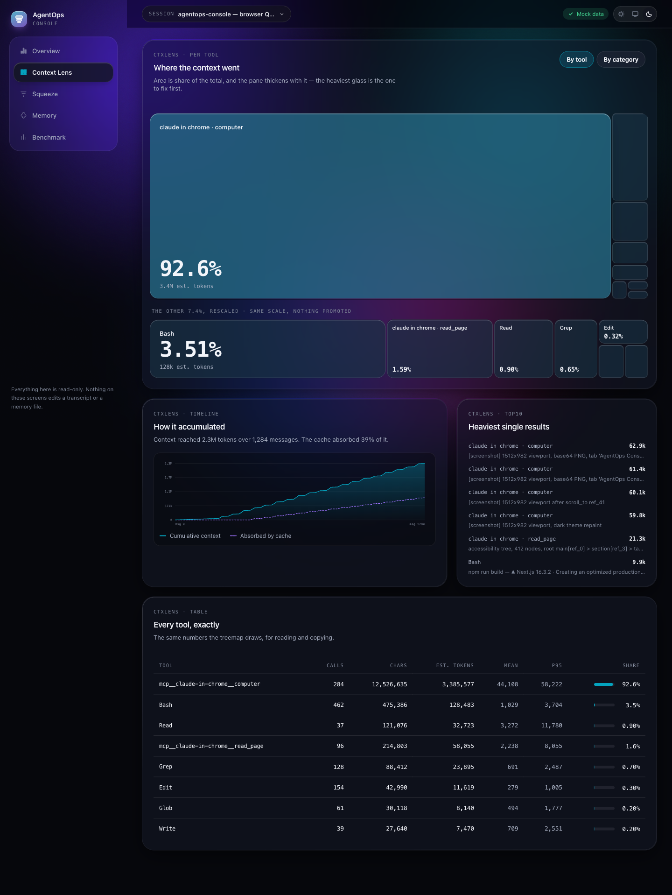
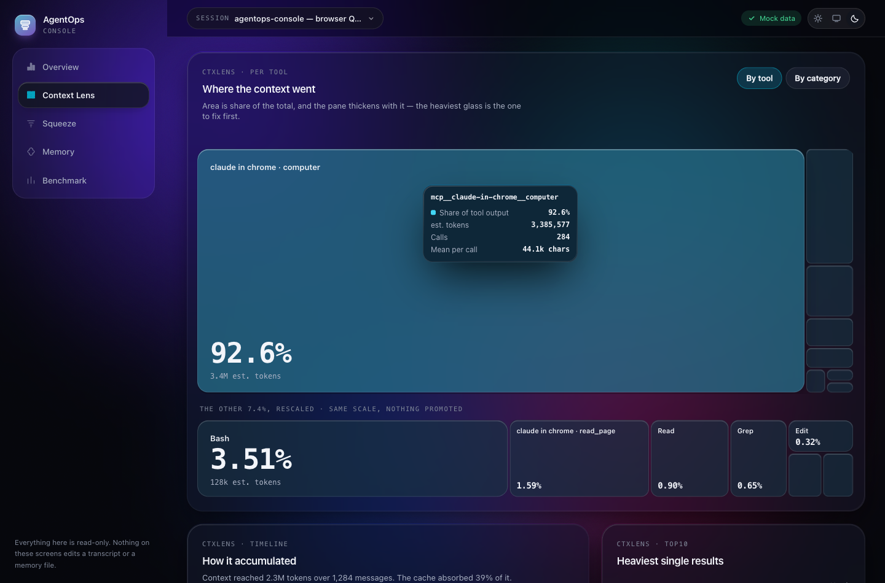
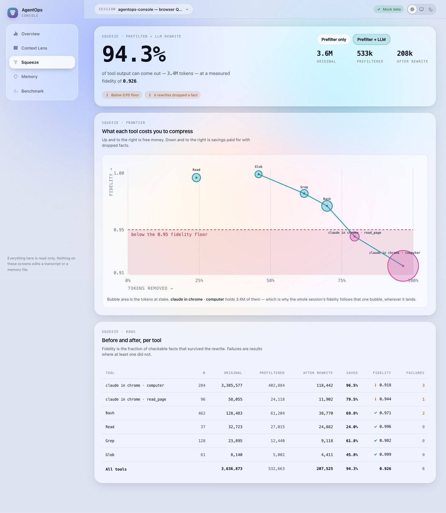
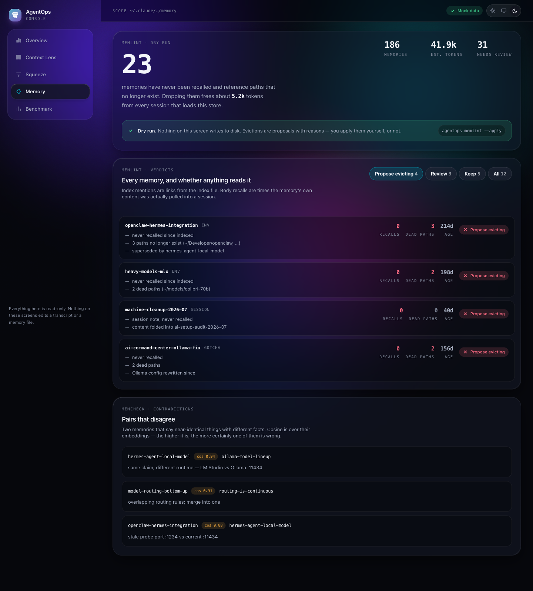
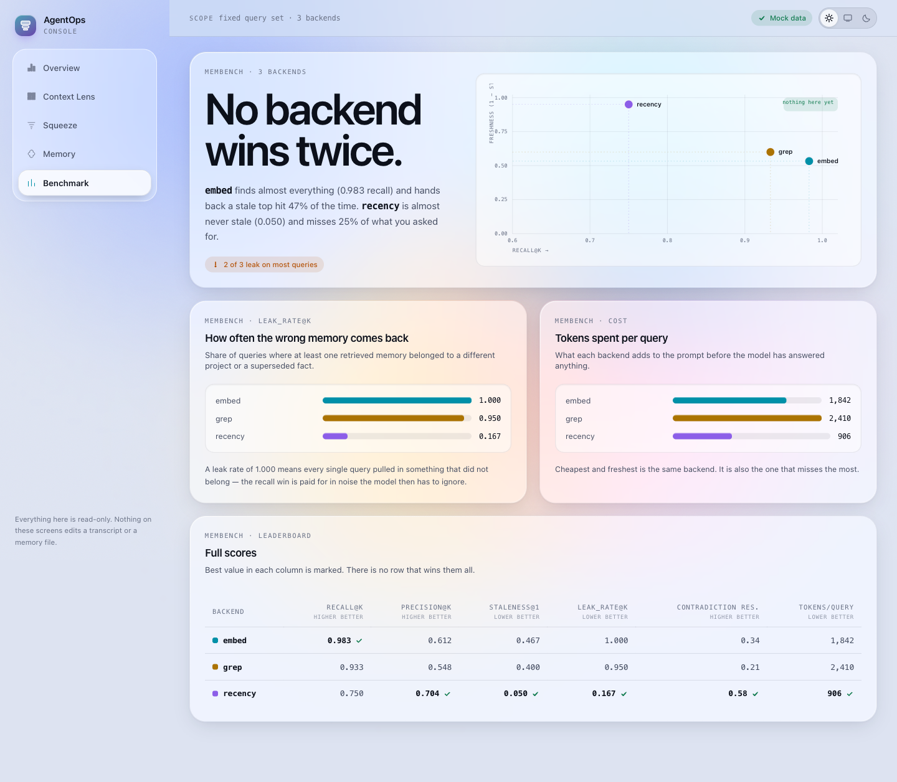
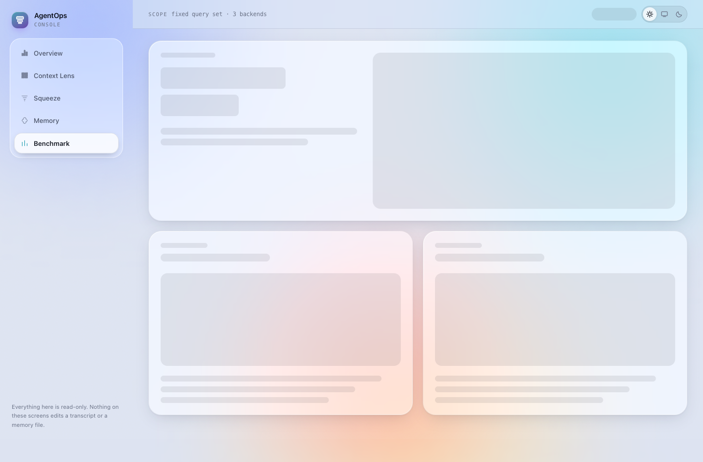
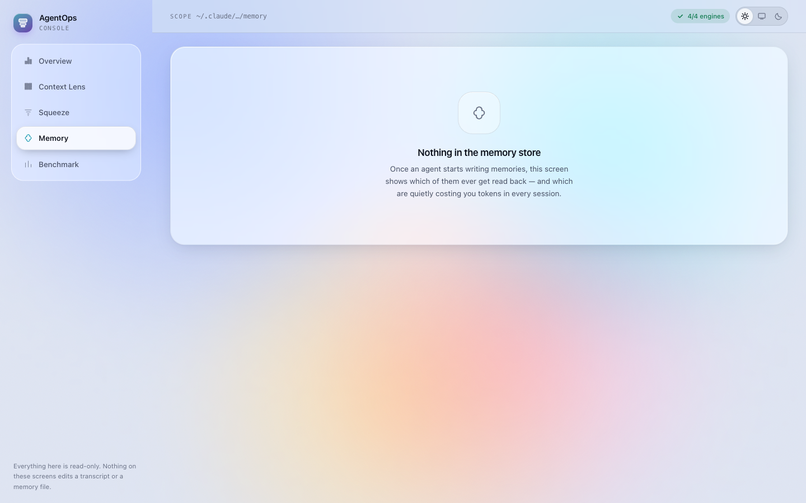
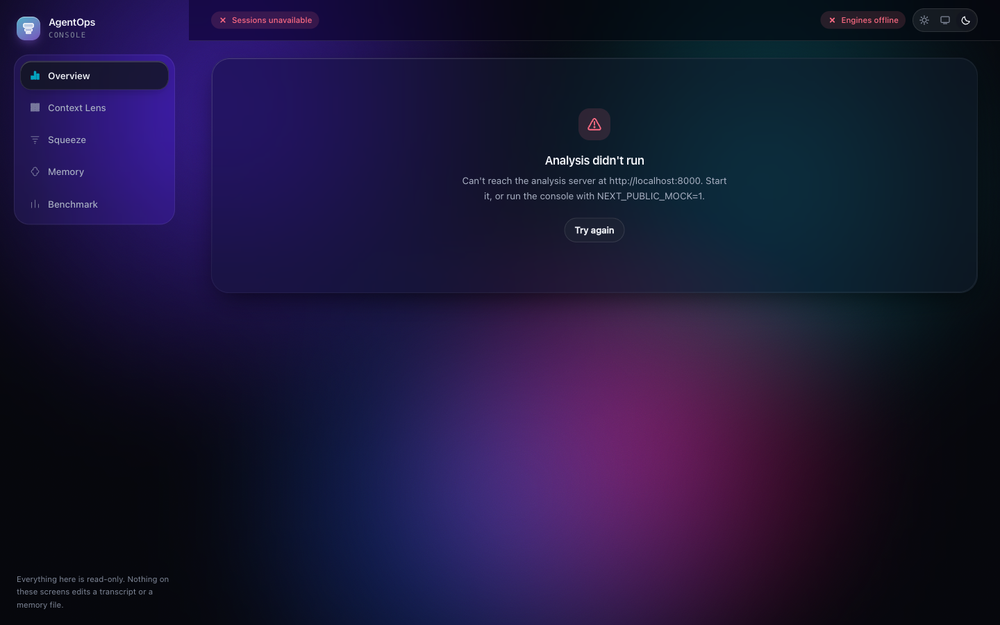
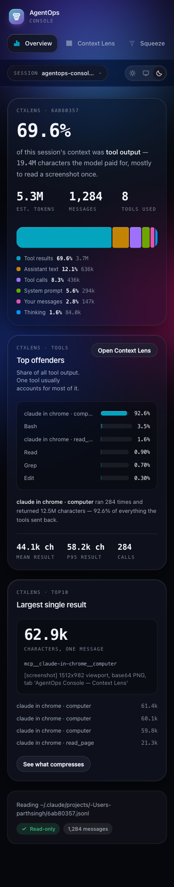

# AgentOps Console

A local web console for seeing what an agent did to your context and your memory —
and what it would cost to fix. It wraps five analysis engines (`ctxlens`, `squeeze`,
`memlint`, `memcheck`, `membench`) behind one interface.

Everything on every screen is read-only. Nothing here edits a transcript or a memory file.



## Run it

```bash
npm install
npm run dev          # http://localhost:3000
```

It runs in **mock mode by default** — no backend needed, every screen fully populated.
The header shows a `Mock data` chip whenever it is on. The fixtures are built on real measured numbers
from a live agent session, so the screenshots are honest:

| measured | value |
|---|---|
| tool results, share of context | 69.6% |
| `mcp__claude-in-chrome__computer` | 284 calls · 12,526,635 chars · 92.6% of tool output |
| `Bash` | 462 calls · 475,386 chars · 3.5% |
| `Read` | 37 calls · 121,076 chars |
| benchmark: `embed` / `grep` / `recency` | recall 0.983 / 0.933 / 0.750 · staleness@1 0.467 / 0.400 / 0.050 |

To point it at the real analysis server instead:

```bash
cp .env.example .env.local   # then set:
NEXT_PUBLIC_MOCK=0
NEXT_PUBLIC_API_BASE=http://localhost:8000
```

`npm run build` produces a static-prerendered production build; `npm start` serves it.

## Screens

| | |
|---|---|
| **Overview** | Headline share of context, the composition ribbon, top offenders, largest single result. |
| **Context Lens** | The signature view — every tool's footprint as a pane of glass, sized and thickened by its share, plus a rescaled map of the remainder and the growth timeline. |
| **Squeeze** | Savings against fidelity per tool, bubble area = tokens at stake, with the fidelity floor drawn. Before/after table underneath. |
| **Memory** | Which memories are never recalled, which point at dead paths, which pairs contradict each other. Framed as a dry run throughout — evictions are proposals with reasons. |
| **Benchmark** | Recall against freshness for each memory backend, plus leak rate and tokens per query. No backend wins twice. |







## States

Every screen has three. All three were verified against a real backend (stubbed empty,
then stopped), not just eyeballed in code.

| loading | empty | error |
|---|---|---|
|  |  |  |

## Design notes

**Liquid glass, with something behind it.** A living aurora sits under the whole app,
so the panels genuinely refract rather than sitting as gray boxes. Three depth tiers —
`.g-base`, `.g-raised`, `.g-float` — differ in blur, fill, specular edge, and shadow,
not just in name. Treemap panes are their own tier: the fill is one hue whose alpha,
blur, and elevation all ride the tool's share, so the worst offender is literally
the thickest slab on the screen.

**Both themes are first-class.** `prefers-color-scheme` is honoured, and the toggle
(light / system / dark) wins in both directions. A pre-paint script applies the stored
choice so the glass never flashes.

**Contrast was computed, not eyeballed.** Every ink token was checked against the
worst-case composite in each theme — white glass over the palest ground in light,
raised glass over the brightest aurora bloom in dark. All clear WCAG AA:

```
light  ink 17.8:1 · ink-2 7.9:1 · ink-3 4.5:1 · accent 3.5:1
dark   ink 13.9:1 · ink-2 7.1:1 · ink-3 4.2:1 · accent 5.0:1
```

**The data palette is validated, not chosen by eye.** The categorical order
(cyan · amber · violet · lime · magenta · azure) and the sequential cyan ramp were
generated in OKLCH and run through the colour-vision / lightness-band / contrast
checks in both light and dark against their real chart surfaces. The first three
slots also clear the all-pairs gate, which is why the three-backend scatter uses
exactly those. Charts are hand-rolled SVG — no chart library.

**Motion.** Spring easing, 180–480ms, and `prefers-reduced-motion` collapses all of
it. The aurora drifts on long alternating cycles and parallaxes gently on scroll.

**Responsive.** The rail becomes a horizontal scroller under `lg`, panels stack, and
wide tables scroll inside their own container. No horizontal page scroll at 390px.



## API contract

Base `http://localhost:8000`. Typed in `src/lib/types.ts`, called from `src/lib/api.ts`.

```
GET  /api/health           -> { ok, engines }
GET  /api/sessions         -> { sessions: [...] }
POST /api/analyze/context  { session_id }            -> categories, tools, top10, timeline
POST /api/analyze/squeeze  { session_id, use_llm }   -> rows, totals
POST /api/analyze/memory   { memory_dir? }           -> totals, memories, contradictions
POST /api/bench/memory     {}                        -> rows
```

Non-2xx responses carry `{ "error": "message" }`, which the console shows verbatim
in its error state.

## Layout

```
src/
  app/            five routes, one file each
  components/     AppShell (rail, header, theme, session picker), Glass primitives
  components/charts/  Ribbon · Treemap · Timeline · TradeoffCurve · BenchScatter · Bars
  lib/            api client + mock fixtures, types, formatters, useAsync
```
